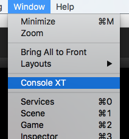
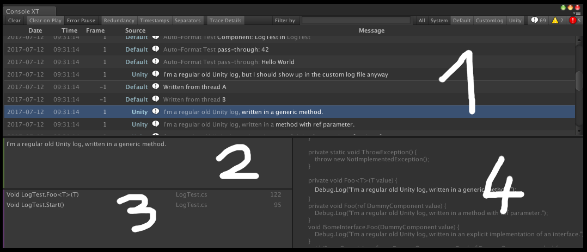

Below, you will find a brief overview on how to use the custom logging library.

# Editor Window

After installing this package, you will find a new menu item under the `Window` menu: Click `Console XT` to open up the new log window. You can drag-drop it to dock next to the Unity Console window, so you can easily switch between the two later on.



Some of the new log window buttons directly mirror functionality from the old Unity Console: `Clear`, `Clear on Play`, `Error Pause` on the left, as well as the message type icons (for messages, warnings and errors) on the right behave exactly like you're used to. In addition to this, you will find the following toolbar items:

* **Redundancy**: When active, redundant parts of adjacent log messages will be "greyed" out to highlight what changed from one line to the next. This is especially useful when there are large numbers of very similar log messages that are only different in a small, but significant part. The redundancy setting helps pinning down those differences more easily.
* **Timestamps**: Toggles whether `Date`, `Time` and `Frame` stamps are displayed next to each log message.
* **Separators**: Toggles whether horizontal separator lines are displayed between log messages that did not occur within the same Unity frame.
* **Trace Details**: Toggles whether selecting a message will display its callstack and source code surroundings.
* **Filter by**: A text field that allows you to filter all displayed messages using a text string or regular expression. Note that the [Mono / .Net flavor of regular expressions](https://www.google.de/search?q=.net+regex+tester) is used.
* **All / System / Default / ...**: There is one button for every log channel that has at least one message in the console. Click on each of them to toggle whether they're displayed.

There are different content areas in the log console, some of which are only visible while a message is selected:



## 1. Main Log Area

* **Click** a message to select it. For messages that have a context object attached to them, this will briefly highlight the context object in the editor.
* **Double-click** a message to jump to the line of source code where the log was written. 
* Press **Cmd+C** to copy a message. 
* You can also use the **arrow keys** and **Page up / Page down** to navigate. 
* As long as you're scrolled to the bottom, the log area will auto-scroll when new messages arrive. This is indicated by a blue bar on the left of the area.

## 2. Message Area

This is where the full message is displayed. Useful for multi-line and very long messages that couldn't be displayed in the main log area.

## 3. Stacktrace

This area provides a stack trace for the selected log message.

* **Click** a stack frame to select it. This will display more context in the source code area.
* **Double-click** a stack frame to jump to the line of source code that is described.
* Stack frames are displayed greyed-out when no matching source file was found for context.
* Stack frames are preceded with an "Unresolved: " prefix when the window was unable to find a matching symbol at all.

## 4. Source Code

This area dislays the source code surroundings for the selected message and stack frame to provide some more context.

# Logging API

Along with the new log console, this package comes with an all new logging API that allows you to use its full functionality. A typical usage will probably look like this:

```cs
// At the top of the file
using ArtCom.Logging;
```
```cs
// Whenever you want to write a log
Logs.Default.Write("Hello World! Foo value: {0}", foo);
```

Let's take a closer look at the last line:

* `Logs` is a static class that provides access to all the log channels, as well as global settings and outputs.
* `Default` is a property that provides access to the default log channel. There is also `System` and `Get<T>` for custom channels.
* `Write` is an instance method on the log channel that writes a regular info message. There are also `WriteWarning`, `WriteError`, `WriteFatal` and `WriteDebug`, each representing a message severity level.
* `Hello World! Foo value: {0}` is the messages format string. Usually, this is a constant value with any number of insertion points for values. It works the same way as Unity's `Debug.LogFormat` and .Net's `string.Format`. For more info on that, take a look at [this docs page](https://msdn.microsoft.com/de-de/library/system.string.format(v=vs.110).aspx), which explains string formatting in detail.
* `foo` is what will be inserted into the logged message at the position of `{0}` inside the string. You can have any number of parameters and reference them by `{index}`.

When logging a more complex operation that spans a larger method call tree, it can sometimes be useful to express scope as part of a log message. One way to do this is by using log indentation:

```cs
Logs.Default.Write("Performing a complex operation...");
Logs.Default.PushIndent();

foo.Bar();
foo.AnotherComplexThing();
foo.Bar2();

Logs.Default.PopIndent();
```

This way, it will become obvious where an operation started and ended, just from looking at the log:

```
[Default] Performing a complex operation...
[Default]   Called foo.Bar
[Default]   Doing foo.AnotherComplexThing...
[Default]     Called nested.Thing
[Default]     Called nested.Thing2
[Default]   Called foo.Bar2
```

When and how log indentation is used is entirely up to you, and it can help in providing a better overview in logfiles and the log console - especially when it's about code that others may not know in-depth.

# Logfile Setup

The custom logging library does not set up a logfile on its own, but it provides a one-liner that you can call in order to do so. When projects use logging, they usually call this right at the beginning of initializing the application. The sometimes used pattern of having a `StartScene` that contains only an `InitApplication` script is a good place for this, but it's up to the user to decide when and how to initialize a logfile.

In the easiest case, this is all you need to do:

```cs
Logs.InitGlobalLogFile();
```

By default, this will ensure a `Logs` directory exists in the local application path, and then create a new logfile named after the current UTC timestamp. If the application path is not writable for some reason (permissions being one of them), it will fall back to using the Unity persistent data path. On Windows machines, this would be the current user's `AppData/LocalLow/CompanyName/ApplicationName`.

When preferred, it is also possible to explicitly set a logfile path and file name pattern in optional method parameters:

```cs
Logs.InitGlobalLogFile("Some\\Logfile\\Directory", "logfile-on-{0:yyyy-MM-dd-HH-mm-ss}.txt");
```

As another optional parameter, it is possible to specify a `TextLogOutputConfig`, describing how log entries will be formatted inside the logfile:

```cs
Logs.InitGlobalLogFile(".", "logfile.txt", new TextLogOutputConfig
{
    WriteFrameStamps = false,
    TimeStampFormat = @"HH\:mm\:ss.fff"
});
```

# Log Formatting

When writing a log entry that involves variables to be inserted, the log needs to convert these values into strings. By default, it will just use .Net's `string.Format` functionality, which will in most cases fall back to each type's `ToString` implementation, but there are some types where it will actually prefer a formatting of its own to help with diagnosing problems. 

For example, when you pass a MonoBehaviour of type Foo into a log message, like so:

```cs
Logs.Default.Write("This is a test: '{0}'", foo);
```

What you will see is something like:

```
[Default] This is a test: 'Foo in Full/Path/ToYourObject/InTheHierarchy'
```

As opposed to just the name that you would get in a regular `ToString` call. Likewise, you will get custom string conversions for any of the following types:

* Components
* GameObjects
* Exceptions
* Stackframes
* AppDomains
* Reflection-related types such as `Type` or `MemberInfo`

Should you want to access any of the custom formatting rules outside of a Write call, you will find them in the static `LogFormat` class, which provides various string conversion methods and string format patterns for diagnostic purposes.

## ToString Implementations

On a different note, it can be a very useful practice to provide your own types with a custom `ToString` override for diagnostic purposes. The log implementation will use them just like they are used in any other formatting operation, and it can make the difference between seeing `ArtCom.XY.RectOffset` and `[Left: 10, Right: 10, Top: 20, Bottom: 10]` in the log.

# Log Channels

This package provides multiple log channels and the facilities to define your own. Every log message will carry its channel as a prefix, and the new log console in the editor allows you to toggle filtering by channel, so you'll only see messages from the channels you're interested in. Different log channels can also behave differently - like one of them ending up in the regular logfile, while another one is re-routed to a TCP stream or elsewhere entirely.

From the user perspective, a log channel is any of the following:

```cs
Logs.Default
Logs.System
Logs.Get<SomeCustomChannel>()
```

In terms of the logging library, log channels are `Log` class instances. A `Log` instance is what you're invoking `Write` or indentation methods on, which it will format and error-check before forwarding them to any number of listener instances that are subscribed to it. A typical listener would then take that message and simply write it into a file.

While you could of course just instantiate and configure your own `Log` instance, you'll often want them to be accessible globally and also avoid situations where someone wants to write to a log before it is actually set up. To help you with that, the static `Logs` class acts as a central place to manage and access log channels, specifically using `Logs.Get<T>()` for custom channels.

To define a custom log channel, simply create a new class that derives from `CustomLogInfo` somewhere in your project. This class will serve as a token to represent the log channel: By default, its name will be used to derive the log channels name and prefix, but you can specify each of them explicitly by overriding the `Name` or `Prefix` properties. You can also override the `InitLog` method to do some additional configuration on the log channel when it is first set up. A very simple custom log channel would look like this:

```cs
public class Foo : CustomLogInfo {}
```

Which then could be used globally like this:

```cs
Logs.Get<Foo>().Write("Hello World: {0}", 42);
```

And, by default, resulting in the following log entry:

```
[Foo] Hello World: 42
```

## Trvia: What's up with that syntax?

When thinking about ways to provide a centralized registry for something, a `Dictionary<string,T>` doesn't sound too bad, right? We'd just do a `Logs.Get("Foo")` and would have achieved the same. So what's up with the generic method thing?

The dynamic lookup using a string or a different value has some drawbacks that don't come for free in a logging library. First, you get the overhead of doing a map / dictionary lookup every time you conveniently want to write a log message. It's not a crucial problem, but an annoying one that you'd probably want to do without if you could. Second, any kind of dynamic lookup suffers from the fact that it can fail at runtime. To avoid both of this, the logging library uses the following pattern to access custom log channels:

```cs
public static void Get<T>() where T : CustomLogInfo, new()
{
    return StaticLogHolder<T>.Instance;
}

private static class StaticLogHolder<T> where T : CustomLogInfo, new()
{
    public static Log Instance;
    
    static StaticLogHolder() {
        // Simplified:
        Instance = new Log();
    }
}
```

The above means that, for every log channel you define, there will be an internal generic class with a static field storing it, which solves both of our problems: Performance will be a non-issue, as there is no lookup. When you write `Logs.Get<T>`, the compiler already knows exactly where it will look for the instance you're retrieving, and it might even optimize away the `Get` call as a bonus. Since you'll need to specify the log channel as a generic parameter, there is also no way for this to fail at runtime, because it won't compile if you mistype the channel name - and your IDE can even do a global symbol rename if you decide to rename the channel.

For the above to be true, we could use any class as a generic argument to identify a log channel. However, by enforcing that we only do this with classes that derive from `CustomLogInfo`, we can use this class to store additional parameters and provide config methods as were mentioned in the section before.

# Log Listeners

A log channel / `Log` instance accepts log messages you put into it, but it won't do anything useful with them. It acts as an endpoint to write messages to, but how they will be handled is up to the log listeners that are subscribed to it.

Every log channel has its own set of listeners, which you can adjust using `AddOutput` / `RemoveOutput` API. It is also possible to add a listener globally to all channels using the static `Logs.AddGlobalOutput` / `Logs.RemoveGlobalOutput` API, which is what happens when the default logfile is initialized. The most common listener type is the `TextWriterLogOutput`, which will transform every log entry into text, and write that text using a .Net `TextWriter` to its underlying `Stream`.

You can define your own listeners by implementing the `ILogOutput` interface in a class, and then adding instances of it to the global or a channels individual output list. Example:

```cs
    public class CustomLogOutput : ILogOutput
    {
        private int indentLevel = 0;

        public virtual void Write(Log source, LogEntry entry, object context)
        {
            // 'source' is the channel where the message was logged.
            //
            // 'context' is an object associated to that message, usually
            // derived from formatting parameters and often a MonoBehaviour
            // or GameObject that was mentioned. It's the object that is
            // highlighted when clicking the message in the editor window.
            //
            // 'entry.Type' specifies message severity (Info, Warning, Error, ...)
            // 'entry.Message' is the string to be logged.
            // 'entry.TimeStampTicks' is the messages UTC tick count.
            // 'entry.FrameStamp' is the Unity frame number when the message was written.

            // Now go and do something interesting!
        }
        public void PushIndent()
        {
            indentLevel++;
        }
        public void PopIndent()
        {
            indentLevel--;
        }
    }
```

```cs
// You would usually do this next to the line where you 
// initialize the global logfile as well.
Logs.AddGlobalOutput(new CustomLogOutput());
```