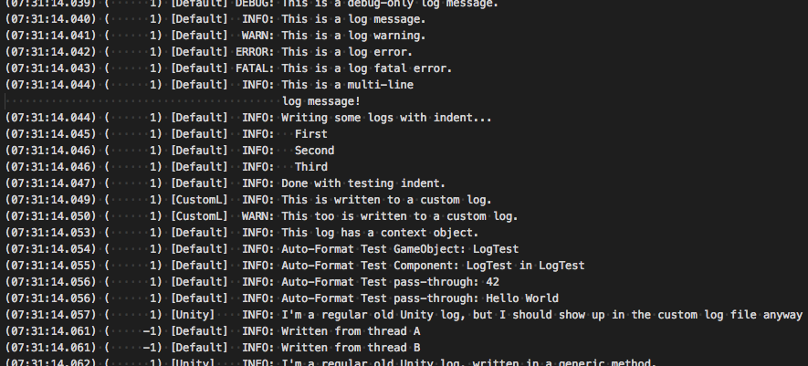
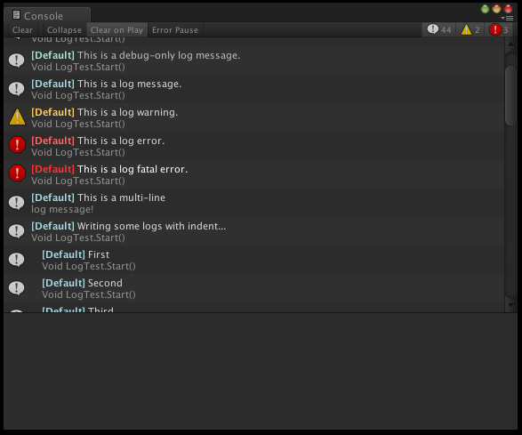

# Summary

This repository implements a custom Unity logging library that provides some extra features that proved to be useful at times. Different versions of it are used in existing Unity projects, such as Upperdeck, Birds, Fraport and VW DLPC. For a more in-depth description on how to use custom logging API and editor windows, take a look at the **[User Manual](Docs/UserManual.md)**.

# Features

A time-based, customizable naming scheme for logfiles:

A customizable logfile format that focuses on readability and providing a reasonable overview:

Integrates with the existing Unity logs for compatibility reasons. Unity logs will show up in the custom logging library, and custom logs will be forwarded to Unity as well. As a bonus, forwarded log messages are rich-text formatted:

A custom log console to replace the Unity one, providing a better overview for larger numbers of logs. It also allows to filter by message type, log channel or custom RegEx, and to browse each messages callstack surroundings in source code:

There's also an experimental Slack integration that allows clients to use a WebHook to post a subset of log messages to a slack channel.

